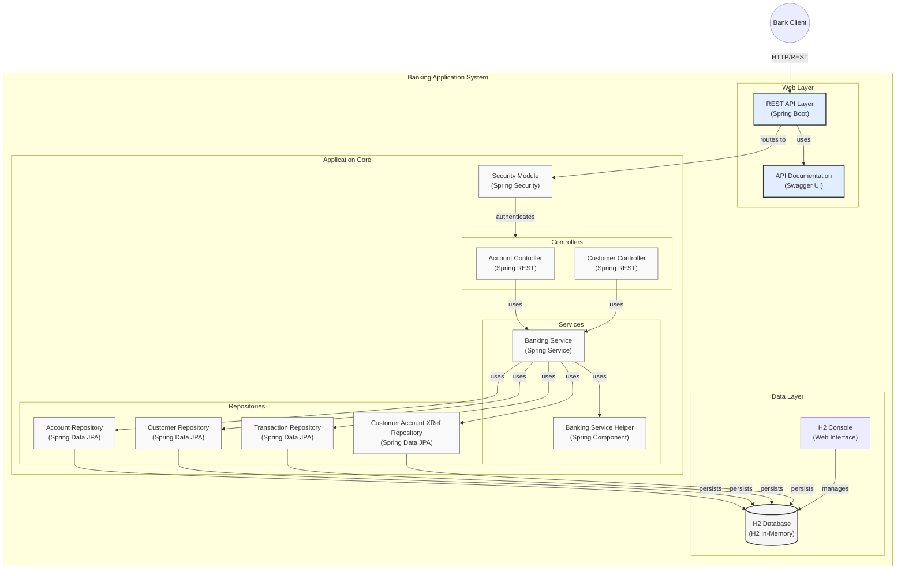

```mermaid
graph TB
    %% External Users
    Client((Bank Client))
    
    subgraph "Banking Application System"
        %% Main Containers
        subgraph "Web Layer"
            API["REST API Layer<br>(Spring Boot)"]
            SwaggerUI["API Documentation<br>(Swagger UI)"]
        end

        subgraph "Application Core"
            SecurityModule["Security Module<br>(Spring Security)"]
            
            subgraph "Controllers"
                AccountCtrl["Account Controller<br>(Spring REST)"]
                CustomerCtrl["Customer Controller<br>(Spring REST)"]
            end
            
            subgraph "Services"
                BankingService["Banking Service<br>(Spring Service)"]
                ServiceHelper["Banking Service Helper<br>(Spring Component)"]
            end
            
            subgraph "Repositories"
                AccountRepo["Account Repository<br>(Spring Data JPA)"]
                CustomerRepo["Customer Repository<br>(Spring Data JPA)"]
                TransactionRepo["Transaction Repository<br>(Spring Data JPA)"]
                XRefRepo["Customer Account XRef Repository<br>(Spring Data JPA)"]
            end
        end

        subgraph "Data Layer"
            H2DB[("H2 Database<br>(H2 In-Memory)")]
            H2Console["H2 Console<br>(Web Interface)"]
        end
    end

    %% Relationships
    Client -->|"HTTP/REST"| API
    API -->|"uses"| SwaggerUI
    
    API -->|"routes to"| SecurityModule
    SecurityModule -->|"authenticates"| Controllers
    
    AccountCtrl -->|"uses"| BankingService
    CustomerCtrl -->|"uses"| BankingService
    
    BankingService -->|"uses"| ServiceHelper
    BankingService -->|"uses"| AccountRepo
    BankingService -->|"uses"| CustomerRepo
    BankingService -->|"uses"| TransactionRepo
    BankingService -->|"uses"| XRefRepo
    
    AccountRepo -->|"persists"| H2DB
    CustomerRepo -->|"persists"| H2DB
    TransactionRepo -->|"persists"| H2DB
    XRefRepo -->|"persists"| H2DB
    
    H2Console -->|"manages"| H2DB

    %% Styling
    classDef container fill:#e1eeff,stroke:#333,stroke-width:2px
    classDef component fill:#f9f9f9,stroke:#666,stroke-width:1px
    classDef database fill:#f5f5f5,stroke:#333,stroke-width:2px
    
    class API,SwaggerUI container
    class AccountCtrl,CustomerCtrl,BankingService,ServiceHelper,AccountRepo,CustomerRepo,TransactionRepo,XRefRepo,SecurityModule component
    class H2DB database
```
